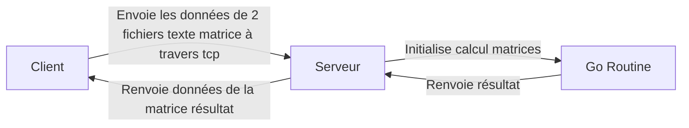

# ELP
3TC-ELP **Lilian Delaye** &amp; **Jean Peaurroy**


## Javascript - CLI
Ligne de commande dans le terminal qui permet de faire diverses fonctions.

Exécution avec:
```sh
node ./main.js
```

Liste des commandes:
```sh
lp -- lists the running processes on the machine
clear -- clears the console
exec (path-to-program) -- runs a program from PATH variables or direct path
bing (-k|-p|-c) (process_id) -- -k kills select process -p pauses and -c resumes
dir -- displays the files and folders in the current directory
cd (directory) -- navigate through directories
exit -- exit the CLI. Ctrl+P also works
history -- Shows previous commands
keep <process id> -- Detaches process id from CLI
<process id> ! -- Launches program, in background.

```

## GO : Matrix multiplication

Serveur et client qui calculent le produit d'une matrice en exécutant des taches en concurrence



Dans le directory, compilation avec:
```sh
go run ./main.go
```

Puis:

```sh
go run ./envoyeurfichier.go
```

## ELM
Application web monopage qui contient un jeu ou il faut utiliser les définitions données pour trouver un mot.

**Database**: [https://dictionaryapi.dev/](https://dictionaryapi.dev/)

Launch with
```sh
elm reactor
```
then go to the specified address
